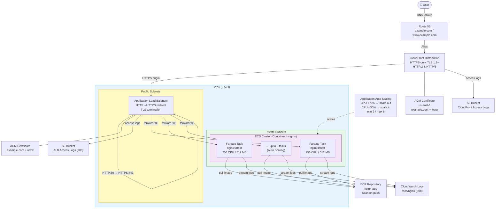
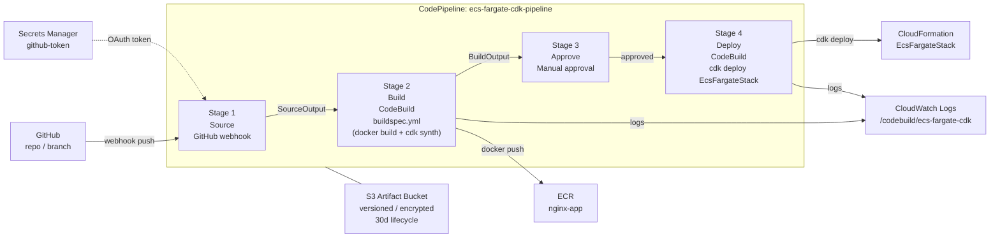

# AWS Architecture Diagram

## Application Stack (`EcsFargateStack`)

---

## CI/CD Pipeline Stack (`PipelineStack`)

---

## Security & Networking Summary

| Layer | Control |
|---|---|
| DNS | Route 53 public hosted zone → CloudFront alias |
| Edge TLS | ACM cert (us-east-1), TLS 1.2+, HTTP/2 & 3 |
| ALB ingress | CloudFront managed prefix list only (pl-3b927c52) |
| ALB → ECS | Security group: ALB SG → ECS SG on :80 |
| ECS tasks | Private subnets, no public IP |
| Image supply | ECR with scan-on-push, 10-image retention |
| Secrets | GitHub token in Secrets Manager |
| Logs | ALB logs (S3, 90d), CloudFront logs (S3), ECS logs (CW, 30d), Build logs (CW, 30d) |
